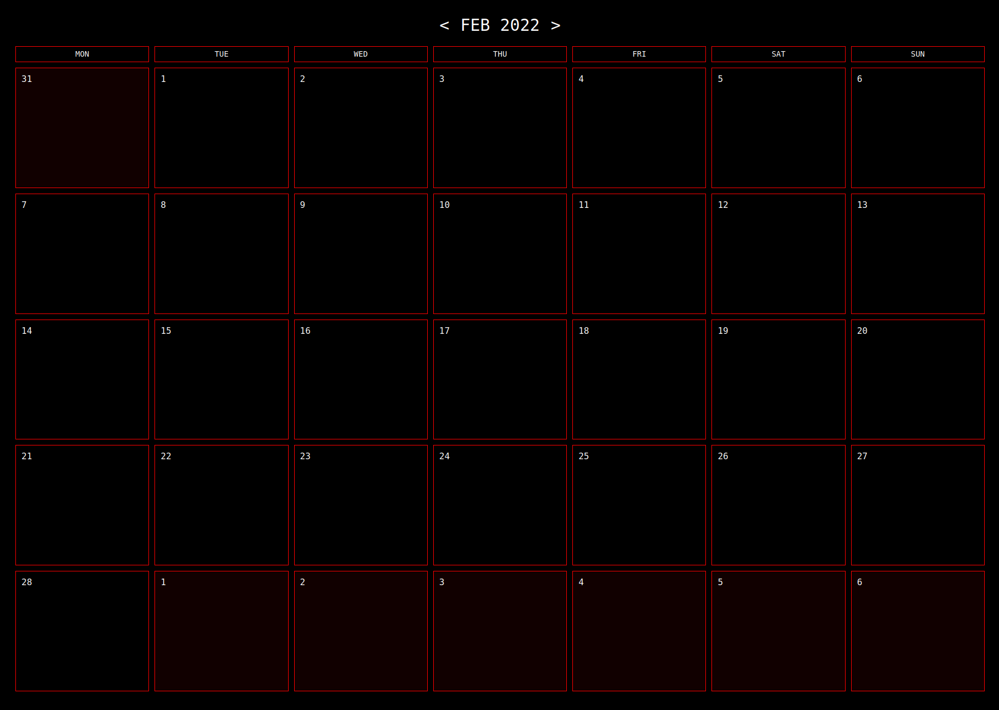

# peercal

 > A p2p calendar

[](https://github.com/peercal/peercal/actions/workflows/test.yml)

**NOTE** Very much a work in progress. You will not be able to do much yet but to flip between months.



## Goals

* Simplicity: Clean design with only a minimum of features
* No servers: Unless running in the browser needing signal server for `hyperswarm-web`
* Decentralized event data via `hyperdrive` and `hyper://` links
* Support for `iCalendar` format (`.ics` files) - [`RFC5545`](https://datatracker.ietf.org/doc/html/rfc5545)

## Usage

Get the code, install and run:

```
$ git clone https://github.com/peercal/peercal.git
$ cd peercal
$ npm install
$ npm start
```

Open the browser at `http://localhost:7777`.

## Instances

Some examples of running instances:

* [`calendar.linkping.org`](https://calendar.linkping.org)

## Build

Running `npm run build` will result in a `public/` folder with static content that you can serve with a web server of your choice.

## Configuration

There's a default configuration in `config.default.json` that can be overridden by providing your own `config.json`. The following can be configured:

### `feeds`

Array of hardcoded read only calendar feeds, which can't be deleted by the user. Useful to define for your own organization where you want your users to always have a particular set of feeds available.

Each item in the array can have the following properties:

* `url` (string, _required_) A `hyper://` address to the feed
* `background` (string, _optional_) The background color of the feed
* `color` (string, _optional_) The text color of the feed

### `swarmOpts`

Configuration object passed to `hyperswarm-web` for bootstrapping websocket and webrtc connections. It has the following properties:

* `bootstrap` (array of strings, _required_) List of `hyperswarm-web` servers

## License

Licensed under `GPL-3.0-or-later`, see [LICENSE](./LICENSE) file for details.

