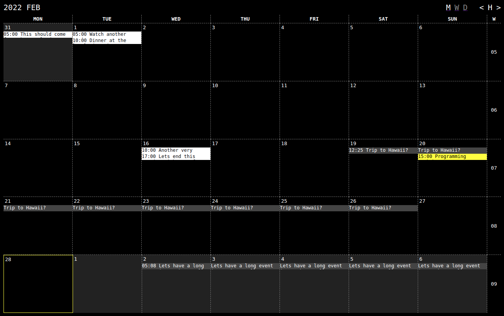

# peercal

> A p2p calendar

**NOTE** Very much a work in progress. You will not be able to do much yet but to flip between months.



## Goals

* Simplicity: Clean design with only a minimum of features
* No servers: Unless running in the browser needing signal server for `hyperswarm-web`
* Decentralized event data via `hyperdrive` and `hyper://` links
* Support for ICS file format

## Usage

Get the code, install and run:

```
$ git clone https://github.com/peercal/peercal.git
$ cd peercal
$ npm install
$ npm start
```

Open the browser at `http://localhost:7777`.

## Build

Running `npm run build` will result in a `public/` folder with static content that you can serve with a web server of your choice.

## License

Licensed under `GPL-3.0-or-later`, see [LICENSE](./LICENSE) file for details.

